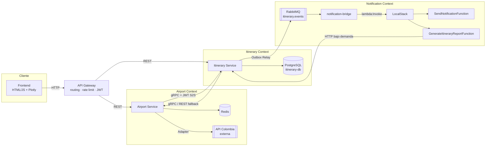
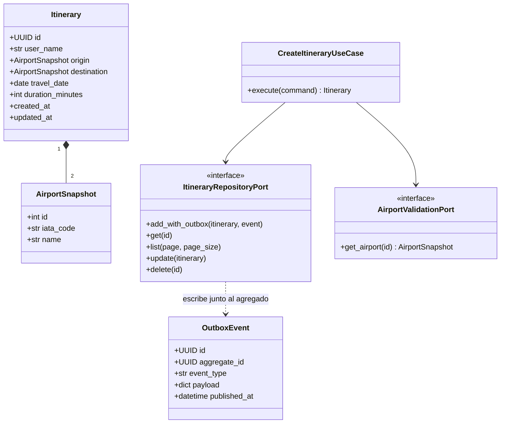
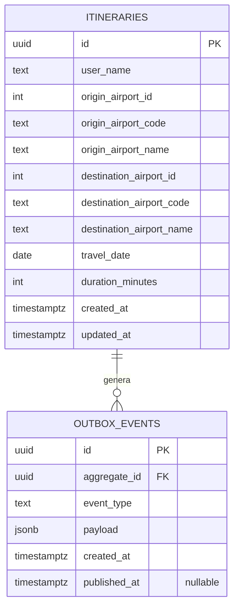
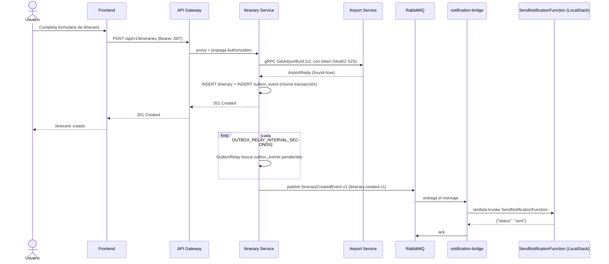
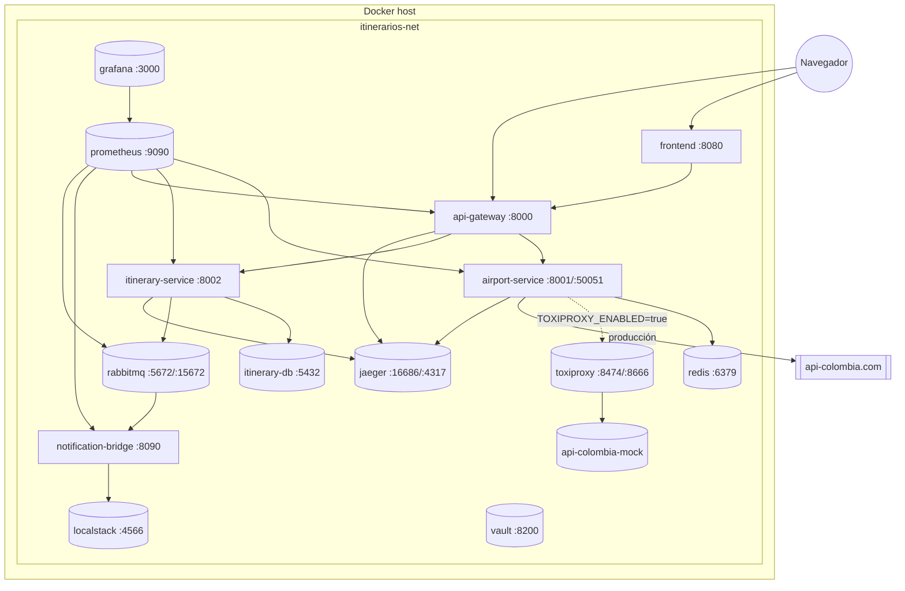

# Sistema de Itinerarios Personales

Sistema de planificación de viajes que integra tres estilos arquitectónicos:
**microservicios**, **arquitectura basada en eventos** y **serverless
(FaaS)**, construido para el reto académico "Sistema de itinerarios
personales" (Nivel 1 + Nivel 2 + Nivel 3).

> **Estado del documento**: código fuente completo y verificado con pruebas
> unitarias locales (57 tests, ver sección 14). La verificación end-to-end
> con `docker compose up` (capturas de Jaeger/Prometheus/Grafana, demo de
> circuit breaker, etc.) queda pendiente porque la máquina usada para
> generar este proyecto no tiene Docker instalado — ver sección 17.

## 1. Arquitectura utilizada

| Estilo | Dónde se aplica | Cómo se demuestra |
|---|---|---|
| Microservicios | Airport Service, Itinerary Service | Servicios independientes, cada uno con su propia base de datos/estado, comunicados por HTTP/gRPC |
| Basada en eventos | Itinerary Service → RabbitMQ → Notification | Transactional Outbox + evento de integración versionado (`docs/asyncapi.yaml`) |
| Serverless (FaaS) | Notification Service, Reportes | Funciones Lambda en LocalStack, activadas por evento o bajo demanda, sin servidor permanente |

Infraestructura compartida: API Gateway (FastAPI), RabbitMQ, Redis, Postgres
(uno por servicio con datos relacionales), LocalStack, Vault, Toxiproxy,
OpenTelemetry + Jaeger, Prometheus + Grafana.

## 2. Contextos Delimitados (Bounded Contexts) y Lenguaje Ubicuo (DDD)

### 2.1 Airport Context (Contexto de Aeropuertos)

Responsable de conocer los aeropuertos colombianos y exponerlos en un
formato de dominio propio, desacoplado de la API externa.

| Término (ubicuo) | Significado |
|---|---|
| Aeropuerto (`Airport`) | Entidad con id, nombre, código IATA, ciudad, latitud/longitud |
| Puerto de Repositorio (`AirportRepositoryPort`) | Contrato del dominio para obtener aeropuertos, sin saber cómo se implementa |
| Adaptador API Colombia (`ApiColombiaAdapter`) | Implementación del puerto que traduce la respuesta externa al modelo de dominio |
| Adaptador con Caché (`CachingAirportAdapter`) | Decorador del adaptador anterior que aplica cache-aside sobre Redis |
| Disyuntor (`CircuitBreaker`) | Mecanismo que corta las llamadas a la API externa cuando falla repetidamente |

### 2.2 Itinerary Context (Contexto de Itinerarios)

Responsable del ciclo de vida de los itinerarios de viaje del usuario.

| Término (ubicuo) | Significado |
|---|---|
| Itinerario (`Itinerary`) | Agregado raíz: nombre del usuario, aeropuerto de salida/llegada (referencia de valor, ver ADR 0001), fecha, duración |
| Caso de Uso (`CreateItineraryUseCase`, etc.) | Orquesta validación + persistencia + evento de dominio |
| Evento de Dominio (`ItineraryCreated`) | Ver ADR 0003 |
| Buzón de Salida (`OutboxEvent`) | Fila transaccional que garantiza la publicación futura del evento de integración (ADR 0002) |
| Evento de Integración (`ItineraryCreatedEvent v1`) | Ver ADR 0003 y `docs/asyncapi.yaml` |

### 2.3 Notification Context (Contexto de Notificaciones)

Responsable de reaccionar a la creación de itinerarios y de generar reportes
bajo demanda, sin mantener un servidor encendido permanentemente.

| Término (ubicuo) | Significado |
|---|---|
| Función de Notificación (`SendNotificationFunction`) | Lambda activada al recibir `ItineraryCreatedEvent` |
| Función de Reporte (`GenerateItineraryReportFunction`) | Lambda invocada bajo demanda para consolidar métricas |
| Puente de Mensajería (`notification-bridge`) | Traduce mensajes de RabbitMQ a invocaciones Lambda (ver sección 5) |

Los tres contextos se comunican **solo** a través de contratos explícitos
(HTTP/gRPC para Airport↔Itinerary, eventos de integración para
Itinerary→Notification) — ningún contexto accede directamente a la base de
datos de otro.

## 3. Patrón Adapter (implementación real)

```
domain/ports.py            -> interfaz AirportRepositoryPort (el "Puerto")
infrastructure/api_colombia_adapter.py -> ApiColombiaAdapter (el "Adapter")
infrastructure/caching_adapter.py      -> CachingAirportAdapter (decora al Adapter)
```

- El dominio de Airport Service (casos de uso) depende únicamente de
  `AirportRepositoryPort`, nunca de detalles de la API externa.
- `ApiColombiaAdapter` traduce el JSON crudo de `api-colombia.com` a la
  entidad `Airport` del dominio (nombres de campo, tipos, ausencia de datos).
- El frontend y los demás servicios **solo** conocen el modelo adaptado
  (expuesto por REST `/api/v1/airports` y por gRPC `airport.v1.AirportService`).
- Esto permite reemplazar la API Colombia por cualquier otra fuente sin tocar
  el dominio ni los consumidores.

## 4. Arquitectura Hexagonal

Cada microservicio (Airport, Itinerary) se organiza en las mismas capas:

```
app/
├── domain/          # Entidades, value objects, puertos (interfaces). Sin dependencias externas.
├── application/     # Casos de uso que orquestan el dominio a través de los puertos.
├── infrastructure/  # Adapters concretos: HTTP externo, Postgres, Redis, RabbitMQ, gRPC.
└── api/             # Routers FastAPI, esquemas Pydantic, inyección de dependencias.
```

La regla de dependencia es siempre hacia adentro: `api` e `infrastructure`
dependen de `domain`, nunca al revés.

## 5. Flujo asíncrono de notificaciones

1. `POST /api/v1/itineraries` en Itinerary Service valida los aeropuertos
   (gRPC a Airport Service) y guarda el itinerario + una fila en
   `outbox_events`, en una sola transacción (ADR 0002).
2. `OutboxRelay` publica `ItineraryCreatedEvent v1` en el exchange
   `itinerary.events` de RabbitMQ.
3. `notification-bridge` consume la cola, y por cada mensaje invoca (AWS SDK
   `lambda:Invoke`) la función `SendNotificationFunction` en LocalStack. Este
   puente existe porque RabbitMQ no es un origen de eventos nativo de AWS
   Lambda; es la pieza mínima necesaria para que el broker "active" la
   función, cumpliendo el espíritu serverless (la función no corre hasta que
   hay un evento, y no mantiene estado entre invocaciones).
4. `SendNotificationFunction` simula el envío (log estructurado) y guarda el
   historial en su propio almacenamiento, deduplicando por `event_id`.
5. `GenerateItineraryReportFunction` se invoca bajo demanda (no reacciona a
   eventos) para consolidar métricas sin sobrecargar los servicios
   principales.

## 6. Double Write Problem

Ver ADR 0002 (`docs/adr/0002-double-write-problem.md`).

## 7. Decisión sobre el Agregado Aeropuerto

Ver ADR 0001 (`docs/adr/0001-agregado-aeropuerto.md`).

## 8. Eventos de dominio vs. eventos de integración

Ver ADR 0003 (`docs/adr/0003-eventos-dominio-vs-integracion.md`).

## 9. Diagramas

### 9.1 Componentes



### 9.2 Clases (Itinerary Context, simplificado)



### 9.3 Modelo relacional (Itinerary Service)



### 9.4 Secuencia — crear un itinerario



### 9.5 Despliegue (docker-compose)



Para Kubernetes ver `infra/k8s/README.md` (mismo sistema, sin las piezas de
infraestructura compartida que normalmente se instalan como charts de Helm
independientes).

## 10. Seguridad

- **Usuarios → sistema**: el API Gateway emite un JWT (HS256) en
  `POST /auth/login` (usuario demo `DEMO_USER`/`DEMO_PASSWORD`) y lo propaga
  tal cual a los servicios internos en cada proxy. Itinerary Service exige
  este JWT en todas sus rutas `/api/v1/itineraries*`.
- **Servicio → servicio (S2S)**: Itinerary Service obtiene un token OAuth2
  Client Credentials de Airport Service (`POST /oauth/token`,
  `OAUTH2_CLIENT_ID`/`OAUTH2_CLIENT_SECRET`) y lo envía como metadata gRPC
  (`authorization: Bearer <token>`); un interceptor gRPC en Airport Service
  rechaza (`UNAUTHENTICATED`) cualquier llamada sin un token válido. Se usó
  esta alternativa (permitida por la rúbrica) en vez de mTLS con Service
  Mesh (Istio/Linkerd) porque no requiere un cluster de Kubernetes real para
  demostrarse con `docker compose`.
- **Endpoints públicos vs. protegidos**: los endpoints de solo lectura de
  Airport Service (`GET /api/v1/airports*`) son públicos a propósito, para
  que el mapa Plotly del frontend funcione sin necesidad de iniciar sesión
  (son datos públicos de aeropuertos); la invalidación de caché
  (`POST /api/v1/airports/cache/invalidate`) sí exige JWT.
- **Secretos**: ver `infra/vault/README.md` — cada servicio intenta leer sus
  secretos de Vault al arrancar y cae a variables de entorno si Vault no
  está disponible.

## 11. Resiliencia y Chaos Engineering

- **Circuit Breaker** propio (async, 3 estados) + **Retry** con backoff
  exponencial y jitter (`tenacity`) + **Bulkhead** (semáforo dedicado)
  alrededor de las llamadas de Airport Service a la API externa — ver
  `services/airport-service/app/infrastructure/resilience.py`.
- **Cache Redis** (cache-aside, con invalidación explícita) reduce la
  dependencia de la API externa en el camino feliz.
- **Chaos Engineering**: en vez de inyectar fallos contra la API pública
  real de un tercero, `TOXIPROXY_ENABLED=true` enruta Airport Service a
  través de Toxiproxy hacia un stub local (`infra/toxiproxy/mock-api-colombia`)
  que imita la forma real de API Colombia. `scripts/chaos_demo.sh` inyecta
  latencia alta y muestra los reintentos y la apertura del circuit breaker
  (visible en `airport_circuit_breaker_state` vía `/metrics` o en el
  dashboard de Grafana).

## 12. Observabilidad

- **Trazas distribuidas**: OpenTelemetry (FastAPI + httpx + gRPC) exportando
  a Jaeger (`http://localhost:16686`) — un request
  frontend→gateway→itinerary→airport comparte `trace_id`.
- **Logs estructurados**: JSON con `trace_id`/`span_id`/`correlation_id` en
  cada línea (`libs/common/common/logging.py` + `correlation.py`), en los
  cuatro servicios Python.
- **Métricas**: Prometheus scrapea `airport-service`, `itinerary-service`,
  `api-gateway`, `notification-bridge` y `rabbitmq` (plugin nativo
  `rabbitmq_prometheus`). Reglas de alerta en
  `infra/prometheus/alert_rules.yml` (circuit breaker abierto, dead-letters
  y backlog en RabbitMQ, bulkhead saturado). Dashboard provisto en Grafana
  (`http://localhost:3000`, datasource y panel ya configurados).

## 13. Kubernetes y CI/CD

- Manifiestos completos en `infra/k8s/` (namespace, ConfigMap/Secret,
  Deployments+Services con `readinessProbe`/`livenessProbe` para cada
  componente) — ver `infra/k8s/README.md` para el orden de aplicación y las
  limitaciones (no se ejecutaron contra un cluster real).
- Pipeline en `.github/workflows/ci-cd.yml`: tests por servicio (matrix),
  build+push de imágenes a GHCR, y un job de deploy documentado como stub
  (requiere secretos de un cluster real que no existían en el entorno donde
  se generó este proyecto).

## 14. Testing

| Suite | Ubicación | Requiere Docker | Estado |
|---|---|---|---|
| Unitarias Airport Service | `services/airport-service/tests/` | No | ✅ 8/8 passed |
| Unitarias Itinerary Service | `services/itinerary-service/tests/` | No | ✅ 19/19 passed |
| Unitarias Notification Bridge | `services/notification-bridge/tests/` | No | ✅ 20/20 passed |
| Unitarias API Gateway | `services/api-gateway/tests/` | No | ✅ 10/10 passed |
| Contract testing (Pact) | `tests/contract/` | Sí (proveedor) | ⏳ código completo, no ejecutado (ver `tests/contract/README.md`) |
| E2E (Testcontainers) | `tests/e2e/` | Sí | ⏳ código completo, no ejecutado (ver `tests/e2e/README.md`) |

**57/57 pruebas unitarias pasan** en un entorno sin Docker, instalando solo
las dependencias mínimas de cada servicio (ver el `README.md` de cada
servicio) — confirmado ejecutando cada suite de forma aislada durante la
construcción de este proyecto.

## 15. Instrucciones para ejecutar el proyecto

```bash
cp .env.example .env
docker compose up --build

# Sembrar secretos de Vault (opcional, los servicios funcionan sin esto
# usando las variables de entorno de .env como fallback):
./scripts/vault_seed.sh

# Frontend:        http://localhost:8080
# API Gateway:     http://localhost:8000/docs
# Airport Service: http://localhost:8001/docs
# Itinerary Svc:   http://localhost:8002/docs
# Notification br: http://localhost:8090/health , /metrics
# RabbitMQ mgmt:   http://localhost:15672 (guest/guest)
# Vault UI:        http://localhost:8200 (token: dev-only-token)
# Jaeger UI:       http://localhost:16686
# Prometheus:      http://localhost:9090
# Grafana:         http://localhost:3000 (admin/admin)
```

Demo de resiliencia/chaos (requiere `TOXIPROXY_ENABLED=true` en `.env` y
reiniciar `airport-service`):

```bash
./scripts/chaos_demo.sh
```

Generar un reporte bajo demanda (Lambda `GenerateItineraryReportFunction`):

```bash
python scripts/generate_report.py
```

## 16. Tabla de autoevaluación

| Nivel | Criterio | Estado |
|---|---|---|
| 1 | Patrón Adapter (Puerto/Adapter, traducción a dominio) | ✅ Implementado y testeado |
| 1 | Arquitectura Hexagonal | ✅ Implementado en los 2 microservicios |
| 1 | DDD básico (contextos + lenguaje ubicuo) | ✅ Documentado (sección 2) |
| 1 | CRUD de itinerarios + validación HTTP/gRPC | ✅ Implementado y testeado |
| 1 | Base de datos relacional | ✅ PostgreSQL (Itinerary Service) |
| 1 | Migraciones de BD versionadas | ✅ Alembic |
| 1 | Swagger por servicio | ✅ FastAPI `/docs` en los 4 servicios Python |
| 1 | Manejo de errores HTTP | ✅ RFC 7807 `problem+json` consistente |
| 1 | Logs estructurados con correlation ID | ✅ JSON + trace_id/span_id/correlation_id |
| 1 | Frontend con Plotly | ✅ Mapa `scattergeo` + CRUD de itinerarios |
| 1 | Docker + docker-compose | ✅ Sistema completo definido — ⏳ sin ejecutar (sin Docker en la máquina de desarrollo) |
| 1 | README y diagramas | ✅ Esta sección |
| 2 | Circuit Breaker | ✅ Implementado y testeado (unitario) |
| 2 | Retry con backoff | ✅ `tenacity`, exponencial + jitter |
| 2 | Cache Redis con invalidación | ✅ Implementado (no ejecutado contra Redis real) |
| 2 | API Gateway (routing, rate limit, JWT) | ✅ Implementado y testeado |
| 2 | Notification Service (3er microservicio) | ✅ `notification-bridge` + Lambdas |
| 2 | Broker de mensajería | ✅ RabbitMQ, definido — ⏳ sin ejecutar |
| 2 | AsyncAPI | ✅ `docs/asyncapi.yaml` |
| 2 | Trazas distribuidas | ✅ Instrumentado — ⏳ sin captura real (requiere Docker) |
| 2 | Propagación de JWT | ✅ Implementado y testeado |
| 2 | Pruebas E2E (Testcontainers) | ✅ Código completo — ⏳ no ejecutado |
| 2 | Demostración de resiliencia | ✅ Script listo (`chaos_demo.sh`) — ⏳ no ejecutado |
| 3 | Transactional Outbox | ✅ Implementado y testeado (ADR 0002) |
| 3 | Consistencia distribuida (Double Write) | ✅ Documentado (ADR 0002) |
| 3 | gRPC | ✅ Implementado y testeado (contrato compilado en build) |
| 3 | Seguridad S2S (OAuth2 Client Credentials) | ✅ Implementado |
| 3 | Vault / Config Server | ✅ Implementado (fallback a env vars) — ⏳ sin ejecutar contra Vault real |
| 3 | Chaos Engineering | ✅ Toxiproxy + stub local — ⏳ no ejecutado |
| 3 | Bulkhead | ✅ Implementado (semáforo dedicado en Airport Service) |
| 3 | Alerting | ✅ Reglas de Prometheus definidas — ⏳ sin disparar en vivo |
| 3 | CI/CD | ✅ Pipeline definido — ⏳ no ejecutado (sin runner/registry) |
| 3 | Kubernetes | ✅ Manifiestos completos — ⏳ no desplegado (sin cluster) |
| 3 | Contract Testing (Pact) | ✅ Código completo — ⏳ no ejecutado |
| 3 | API versioning + paginación | ✅ `/api/v1/...` + `{items,page,page_size,total}` |

## 17. Limitaciones conocidas

Este proyecto se generó en una máquina **sin Docker instalado**. Por lo
tanto:

- Todo lo que depende únicamente de Python (dominio, casos de uso, lógica de
  negocio, traducción del Adapter) está **verificado con 57 pruebas
  unitarias reales, ejecutadas durante el desarrollo**.
- Todo lo que depende de contenedores (Postgres, RabbitMQ, Redis, LocalStack,
  Vault, Toxiproxy, Jaeger, Prometheus, Grafana, y por tanto también las
  pruebas E2E, el contract testing del lado proveedor, la demo de chaos, las
  trazas reales y las capturas de evidencia pedidas en los entregables)
  **no se ejecutó de punta a punta** — el código y la configuración están
  completos y se consideran listos para `docker compose up`, pero esa
  verificación queda pendiente para cuando el proyecto se despliegue con
  Docker instalado.
- Kubernetes y CI/CD son manifiestos/pipelines de referencia, no probados
  contra un cluster o runner real.
